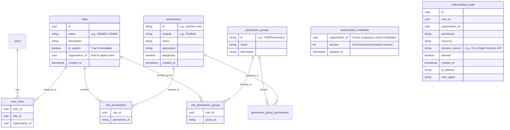

# StudioHQ Backend Authorization Model

This document defines the schema, data flows, and architectural boundaries for the StudioHQ backend authorization layer. It enforces the registry-driven frontend by shifting the canonical source of truth into PostgreSQL, ensuring security at the lowest possible level (Row Level Security).

---

## 1. Entity-Relationship Diagram

The authorization schema separates users, roles, and permissions into a normalized architecture that supports future multi-tenancy and custom roles.



---

## 2. Multi-Tenancy Isolation

Tenant isolation is strictly enforced across the authorization schema.

- **System Roles vs Custom Roles:** System roles (e.g., `OWNER`, `ADMIN`) have `organization_id = NULL`. These are global templates applied across all tenants. Custom roles have a specific `organization_id`. Organization A can never see or assign Organization B's custom roles.
- **Assignment Scoping:** Every lookup in `user_roles` strictly evaluates both `user_id` and `organization_id`.
- **Cross-Tenant Memberships:** Yes, one user can belong to multiple organizations simultaneously. Their JWT will contain the `organization_id` of their currently active tenant context, and `app_metadata.roles` will only reflect roles assigned for that specific tenant.

---

## 3. Source of Truth: The Neutral Artifact

The backend schema and the frontend constants must share the exact same permissions. We do NOT generate the database from the frontend. Instead, we maintain a neutral artifact:

`authorization/permissions.yaml`

This single artifact is consumed via generation scripts to produce:
1. **Frontend Constants:** (`src/auth/permissions.ts` -> `Permission.PORTFOLIO_READ`). **No permission identifier may ever be written manually outside the generated artifacts.**
2. **Backend Seed Migration:** (`permissions.sql`).
3. **Documentation:** (`permissions.md`).

---

## 4. JWT Claims Strategy

Supabase JWTs will remain extremely lightweight. Authorization roles must live in `app_metadata` to prevent users from modifying them.

**JWT Payload:**
```json
{
  "app_metadata": {
    "provider": "email",
    "roles": ["OWNER", "STRATEGIST"],
    "organization_id": "org_123"
  },
  "user_metadata": {
    "name": "Jane Doe"
  }
}
```

**Injection Flow:**
Supabase Auth Hooks (or an Edge Function on login/refresh) will query the `user_roles` table and inject the `roles` and `organization_id` into the JWT `app_metadata`.

---

## 5. Row Level Security (RLS) Flow

Directly querying roles in RLS (e.g., `role === 'OWNER'`) is strictly prohibited. All RLS policies must delegate to a single, optimized Postgres function: `has_permission()`.

**The Function:**
```sql
CREATE OR REPLACE FUNCTION has_permission(p_permission text)
RETURNS boolean AS $$
BEGIN
  -- Extracts auth.uid() internally.
  -- Resolves user -> roles -> permissions AND user -> roles -> groups -> permissions.
  -- Utilizes an indexed materialized view or direct joins.
  RETURN EXISTS (
    SELECT 1 FROM effective_permissions ep
    WHERE ep.user_id = auth.uid() AND ep.permission = p_permission
  );
END;
$$ LANGUAGE plpgsql SECURITY DEFINER;
```

**Runtime Authorization Flow:**
```text
User Request
      │
      ▼
JWT (app_metadata)
      │
      ▼
current_roles()
      │
      ▼
current_organization_id()
      │
      ▼
effective_permissions (View)
      │
      ▼
has_permission()
      │
      ▼
TRUE / FALSE
```


---

## 6. SQL Views for Administration & Resolution

To simplify debugging, admin tooling, and support, the database exposes central views:

### View 1: `effective_permissions`
Used for authorization resolution.
- `user_id`, `permission`, `organization_id`, `role_name`

### View 2: `effective_role_assignments`
Used for administration dashboards to easily display who holds what roles and what permissions those roles grant.
- `user_id`, `organization_id`, `role_id`, `role_name`, `granted_permissions[]`

---

## 7. Permission Propagation SLA & Cache Invalidation

**SLA Guarantee:** Authorization changes propagate within 60 seconds or immediately after a forced session refresh.

To achieve this without stale cache bypasses, we use tenant-aware versioning:
1. **Mutation:** Admin updates `role_permissions` for Tenant A.
2. **Trigger:** Postgres trigger increments the `version` for Tenant A in `authorization_metadata`.
3. **Realtime:** Supabase Realtime broadcasts `auth_version_changed` for Tenant A.
4. **Invalidation:** Edge caches and Frontend clients immediately drop their local cache, forcing a silent JWT refresh and refetching the latest permissions.

---

## 8. Audit Flow

All destructive mutations (and all authorization denials) will be recorded via asynchronous logging to `authorization_audit`.

> **Audit logging must never block the original transaction.** 

1. **Trigger:** `has_permission` function or Edge Function evaluates a sensitive permission.
2. **Log:** An asynchronous insert is queued to `authorization_audit` (e.g., via Postgres advisory locks, async workers, or edge logging queues) to ensure failure to log never crashes a valid business action. Log includes `organization_id` and `decision_source` (e.g., 'RLS', 'Edge').

---

## 9. Operational Procedures

### Bootstrap Problem
For brand-new deployments with an empty database:
1. Database migrations run and seed system roles (`OWNER`, `ADMIN`).
2. The first user to successfully authenticate automatically intercepts the `BootstrapTrigger`.
3. This user is assigned the `OWNER` role and global `organization_id`.
4. Bootstrap is then disabled forever.

### Break-Glass Access
In the event of catastrophic authorization failure (e.g., all `OWNER` assignments accidentally deleted, corrupted tables):
1. Normal application code can **never** bypass authorization.
2. Recovery requires executing a service-role-only SQL script (`scripts/break_glass_recovery.sql`) that completely wipes and resets the `OWNER` assignments to a specified executive email. This script bypasses RLS utilizing `postgres` privileges.

---

## 10. Backend Implementation Phases (The C Series)

| Phase | Title | Description |
|---|---|---|
| **C1** | **Authorization Schema** | Create `roles`, `permissions`, `role_permissions`, `user_roles`, `permission_groups`, `role_permission_groups`, `authorization_metadata`, and `authorization_audit` tables. |
| **C2** | **Views** | Create `effective_permissions` and `effective_role_assignments` views. |
| **C3** | **Seed Taxonomy** | Generate `permissions.sql` directly from `permissions.yaml`. Seed all system roles and mappings. |
| **C4** | **Authorization Service** | Create `has_permission(permission_id)` using `auth.uid()`. |
| **C5** | **JWT Integration** | Implement Supabase Auth Hooks to inject `roles` into `app_metadata`. |
| **C6** | **RLS Rewrite** | Rewrite all existing database policies to use `has_permission()`. |
| **C7** | **Compatibility Removal** | Delete legacy role mapping layers in the frontend `AdminGuard`. |
