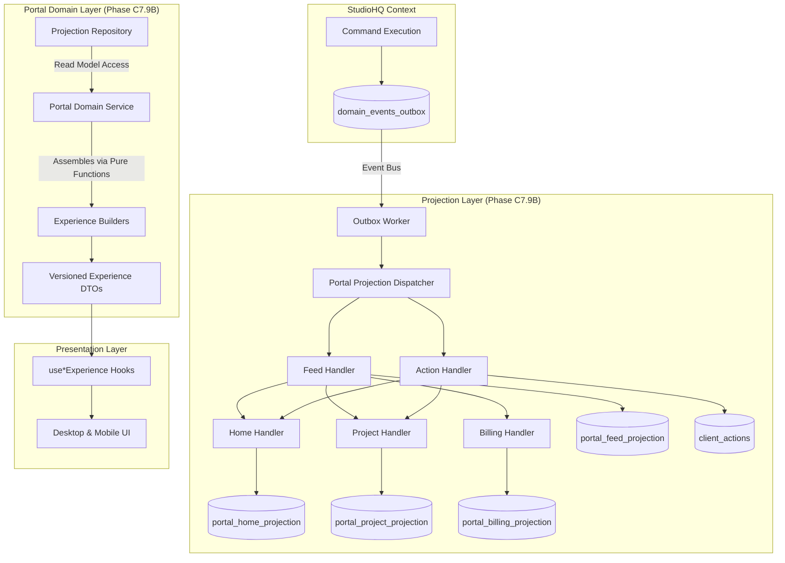

# Client Portal Architecture (v1.0 FROZEN)

The Client Portal is a **dedicated bounded context** distinct from StudioHQ. While StudioHQ manages the operational reality of projects, the Portal manages the **client experience** of those projects.

## 1. Domain Language (Ubiquitous Language)

The Portal does not share terminology with StudioHQ internals. 

| StudioHQ Internal (Do not use in Portal UI) | Portal Concept (Use these) | Description |
|---|---|---|
| `project` | **Workspace** / **Project** | The container for a client's engagement. |
| `timeline_event` | **Feed Item** | A chronologically organized piece of information for the client. |
| `deliverable_file` | **Deliverable** | A final artifact shared for client consumption. |
| `milestone` | **Stage** / **Milestone** | A significant phase of the engagement. |
| `project_credential` | **Credential** | Access details explicitly shared with the client. |
| `project_environment` | **Environment** | A deploy target the client can interact with. |

*In addition to these, the Portal introduces its own native concepts:*
- **Client Action**: A task specifically requiring the client's attention (e.g., "Sign Contract").
- **Experience**: A curated composition of domain data tailored for a specific screen (e.g., "Home Experience").

---

## 2. Read Model Architecture (CQRS)

The Portal strictly follows CQRS principles. The UI does not query raw relational data; it queries pre-assembled Read Models.

### Dependency Rules:
- The UI layer **must never** import repository types, Supabase clients, or internal database models.
- **Experience Builders** must be pure functions. They do not perform async work or data fetching.
- **Portal Domain Service** handles orchestration and fetching from the repository, then passes data to the builders.
- **Repository** hides the storage implementation. Today it might fetch raw tables; tomorrow it fetches pure read models. The UI doesn't know.

### Client Actions Projection
`client_actions` is explicitly an event-driven projection, not a CRUD resource.
Example: `InvoiceIssued` -> `ClientActionProjector` -> inserts a record into `client_actions`.

### The Feed Projection Invariant
> **Every client-visible domain event must produce exactly one Feed Item.**

Whether the event is an Invoice, Deployment, Meeting, Deliverable, Credential, or Milestone update, the outcome is always a Feed Item. Every experience consumes this unified feed instead of assembling different timelines.

---

## 3. Experience Contracts (DTOs)

The contract between the backend logic and the frontend UI is defined by Versioned Experience DTOs (e.g., `HomeExperienceDTO_v1`).

### Versioning Strategy
DTOs are suffixed with a version (e.g., `_v1`). 
- When an API contract needs to change in a non-backwards-compatible way, a `_v2` DTO is created.
- The Domain Service will route the request to a `HomeExperienceBuilder_v2`.
- This ensures mobile app clients (which cannot force updates) do not crash when the backend evolves.

---

## 4. Mobile vs Desktop Philosophy

The UI consumes the exact same Experience DTOs, but renders them with fundamentally different philosophies:

**Desktop = Analyze**
- The user is sitting at a desk and has time to dive deep.
- Data is presented in expansive, high-density layouts (dashboards, tables, split views).
- Focus: Context, exploration, status monitoring.

**Mobile = Decide + Act**
- The user is on the go and has 30 seconds.
- Data is presented sequentially. Priority items are forced to the top.
- Focus: "What is wrong?", "What do you need from me?", "What just happened?"

---

## 5. Realtime Flow

The portal relies heavily on Supabase Realtime to keep the client experience instant.

1. **`usePortalRealtime()`** is attached at the layout level (e.g., `page.tsx`).
2. It watches the relevant tables (and eventually the projection tables).
3. Upon detecting a change, it automatically invalidates the React Query cache via `portalQueryKeys`.
4. This causes the `Portal Domain Service` to re-fetch the data, re-run the `Experience Builder`, and push a new DTO to the UI.

---

## 6. Extension Points (Future)

The event-driven architecture makes extending the portal trivial:

- **Notifications / Webhooks**: A worker can listen to `domain_events_outbox` and push APNs/FCM notifications or Slack alerts.
- **AI Summaries**: An LLM worker can intercept a `feed_item_created` event and generate a TL;DR summary for the `HomeExperienceDTO`.
- **Native Mobile Apps**: A Swift or Kotlin app can hit an API endpoint that simply serializes the `HomeExperienceDTO_v1` into JSON, requiring zero business logic in the app.

---

## 7. Operational Invariants

These invariants are the long-term engineering guardrails for the Portal bounded context. They must never be violated without a formal ADR.

1. **Idempotency:** Projection handlers are strictly idempotent. Processing the same event twice must not create duplicate projection state.
2. **Deterministic Output:** Every client-visible event produces exactly one Feed Item.
3. **Replayability:** Replay is deterministic. Read models can always be rebuilt entirely from the outbox.
4. **Contract Stability:** Experience DTOs are strictly versioned (e.g. `HomeExperienceDTO_v1`).
5. **Decoupled Persistence:** Repository implementations are replaceable (feature-flag cutovers).
6. **Pure Assembly:** Experience Builders are side-effect free.
7. **Disposable Projections:** Projection tables are disposable and hold no source of truth.
8. **UI Isolation:** UI never imports repository/database types. (Only Experience DTOs).
9. **UI Parity:** Desktop and Mobile consume identical Experience DTOs.
10. **Backend Isolation:** StudioHQ commands never call Portal UI directly.
